# RH Workflow Desk

纯本地 RunningHub API 工作流提交 Web 应用。运行状态和缓存保存在本目录下的 `data/`；基础积木源文件保存在 VideoMake 参考资源目录：

- `data/keys.json`：本地 API Key（权限 600）
- `data/accounts.json`：本地托管账号的名称、站点和签到状态（权限 600，不保存密码或 token）
- `data/tasks.sqlite3`：任务历史、状态、taskId、阶段日志和脱敏后的 `error_detail`
- `data/tasks.sqlite3` 中的 `usage_records`：独立用量台账，供仪表盘统计；删除任务不会删除该记录
- `data/workflow/<workflow_id>/workflow_api.json`：工作流包中的 API 工作流文件
- `data/workflow/<workflow_id>/prompt_group.json`：工作流包内部的提示词组文件，不作为工作流页面中的独立资源
- `data/workflow/<workflow_id>/manifest.json`：工作流注册文件，保存顶层配置并索引同目录下的工作流文件和提示词组文件
- `data/workflow-registry.json`：工作流库的内部目录索引；只有登记到这里的完整工作流包会显示在“工作流”页面
- `data/pasted-inputs/`：从剪贴板粘贴的图片输入副本，供任务提交时使用
- `data/outputs/`：默认输出目录下的任务产物；每个 `<task_id>/` 还会保存本次提交的 `workflow_api.json`、`prompt_group.json` 和路径清单 `manifest.json`。输入文件不复制到任务目录，只在任务记录、工作流快照和清单中保存原始路径
- `VideoMake/ref/Resources.json`：ref 资源目录和各 JSON 索引的机器可读入口；其中 `sources.prompt` 指向提示词基础积木文件。`data/prompt/state.json` 保存当前临时组装顺序；独立提示词组文件只作为历史或兼容数据保留，新的工作流包以自身携带的提示词组为准。基础积木路径由该索引解析，内容放在 JSON 的 `blocks` 数组中，每项包含 `id`、`category`、`tags`、`title` 和 `text`
- `VideoMake/ref/pose/pose.json`：动作库 JSON 源文件。动作原图、深度图和骨骼图仍从 ref 原目录读取，不会复制到本项目
- `VideoMake/ref/Resources.json`：ref 资源目录和各 JSON 索引的机器可读入口清单
- `web/docs/translation.md`：提示词工坊自由文本的阿里云翻译配置和英文导出规则
- `web/docs/telegram.md`：任务完成后的 Telegram Bot 成片推送配置和投递规则

仪表盘入口为 `/dashboard`，支持 `1D`、`7D`、`30D` 时间范围，并可在“消耗概况”中按账号筛选或查看全部账号；日消耗、提交次数和处理时长来自 SQLite 中独立的 `usage_records`，已识别的视频产物还会用于计算并发场景下的单位视频响应效率，不会因为删除历史任务而消失。仪表盘的“高分工作流”只统计工作流库中已登记的工作流，并复用成片库当前可见产物的评分，按已评分星级总和列出当前范围前 5 名。余额按账号去重，每个账号只取最近一次成功查询的一个 API Key，避免同一账号的多个 Key 重复累加。

## 启动

在仓库根目录运行：

```bash
./web/start.sh
```

默认地址为 `http://127.0.0.1:8766`。也可以不自动打开浏览器：

```bash
./web/start.sh --no-browser
```

macOS Electron 开发版：

```bash
cd web
npm install
npm run electron
```

Electron 版本会自动启动本地 Python 服务，并让拖入文件同时获得本机绝对路径和图片预览。关闭窗口时会停止本地服务。

### macOS 正式安装包

Apple Silicon（arm64）用户可以直接从 [GitHub Releases](https://github.com/LLsetnow/RH_CLI/releases/latest) 下载 `.dmg` 安装包；发布页同时提供 `.zip` 和 `SHA256SUMS.txt`。当前安装包未使用 Apple Developer ID 签名，首次打开时如果 macOS 拦截，请在 Finder 中右键应用选择“打开”，或在“系统设置 → 隐私与安全性”中允许。

从源码重新构建 Apple Silicon 安装包：

```bash
cd web
npm install
npm run package:mac
```

构建会先用 PyInstaller 打包内置 Python 本地服务，再生成带当前版本号的 `web/dist/RH-Workflow-Desk-0.3.0-arm64.dmg`、对应 `.zip` 和校验文件；安装后的任务数据写入 macOS 用户数据目录。

## 工作流快照与工作流库

工作流页面把“正在使用的工作流”和“长期保存的工作流”分开处理。大多数时候，你编辑的是临时工作流快照；只有明确点击“保存到工作流库”，它才会成为长期可复用的工作流。

### 1. 从外部导入工作流快照

把 API 格式的 JSON 导入任务提交页或工作流页面后，应用会创建一份临时工作流快照。你可以修改节点、输入路径、提示词、账号、RunningHub `workflowId` 和输入默认值。此时不会修改原始 JSON，也不会自动出现在工作流库中。

### 2. 将快照保存到工作流库

点击“保存到工作流库”后，应用会把当前快照保存成一个完整的工作流包，包括工作流配置、API 工作流和关联的提示词组。提示词组属于工作流包内部，不需要单独管理；工作流页面也不会把它显示成独立的“组状态库”。

### 3. 从工作流库加载工作流

从工作流库点击“加载”时，应用会复制一份新的临时工作流快照。之后的编辑只作用于这份快照，库里的原工作流不会被直接修改。

### 更新已经保存的工作流

更新库内工作流时，应用不会原地覆盖旧版本。正确流程是：

```text
加载旧工作流 A
    ↓
编辑临时快照
    ↓
将快照保存为新的工作流 B
    ↓
迁移 Telegram、文件夹等活动引用
    ↓
删除旧工作流 A
```

只有 B 保存成功、三个组成文件都能读取、活动引用迁移成功后，才会删除 A。任务历史不会跟着迁移或删除；任务提交时已经保存了自己的工作流、提示词组和执行参数快照。

### 三种状态的区别

| 名称 | 是否可以编辑 | 是否显示在工作流库 | 生命周期 |
| --- | --- | --- | --- |
| 临时工作流快照 | 可以 | 否 | 从外部导入或从工作流库加载后产生 |
| 工作流库条目 | 通过新快照替换 | 是 | 用户明确保存，或主动删除 |
| 任务快照 | 否 | 否 | 提交任务时创建，任务历史保留 |

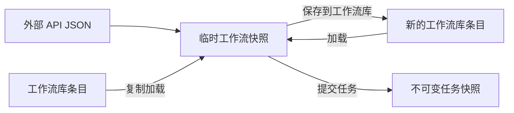

## 使用路线与产品理念

RH Workflow Desk 不是单纯的“上传文件并调用接口”工具，而是一个本地优先的 AI 工作流生产台：用工作流定义能力，用提示词和媒体库定义内容，用本地队列保证执行，用成片反馈推动迭代。

### 推荐主路线

对于需要长期复用的工作，推荐把当前临时快照保存成一个可恢复的工作流包：

```text
工作流 API JSON
+ 输入配置
+ Prompt Group
+ 账号 / RunningHub workflowId
= 可复用工作流包
```

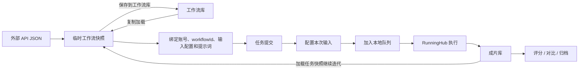

如果已经有现成的 API JSON，也可以直接走最短路线：

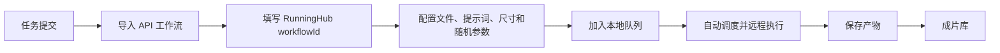

### 三、完整产品闭环

完整产品闭环不是一次性的“提交并等待结果”，而是从运行环境准备、内容编排、工作流执行，到成片评估和下一轮复用的连续过程。每个阶段都会产生下一阶段需要的数据，最终把一次生成沉淀为可重复使用的工作流资产。

| 阶段 | 使用者主要动作 | 形成的数据或结果 |
| --- | --- | --- |
| 1. 一次性配置 | 设置账号、API Key、媒体库、产物目录和并发策略 | 本地运行环境与调度规则 |
| 2. 选择生产入口 | 选择已有工作流、导入 API JSON、进入提示词工坊或使用 Telegram | 本次任务的工作流来源 |
| 3. 组织内容 | 组合提示词积木、真实媒体卡片、自由文本和输入文件 | Prompt Group、输入配置和任务草稿 |
| 4. 提交执行 | 配置尺寸、RandomNoise、旁路节点并加入队列 | 本地任务记录、排队状态和远程任务 |
| 5. 保存结果 | 远程执行完成后轮询、下载并保存产物 | 成片文件、工作流快照、提示词组快照和 manifest |
| 6. 回看评估 | 在成片库预览、归类、评分、对比、导出或推送 | 成片反馈、项目归类和用量数据 |
| 7. 复用迭代 | 加载旧任务或工作流，修改输入后再次提交 | 更稳定的工作流包和下一轮生产 |

其中，工作流决定“如何执行”，Prompt Group 和媒体库决定“生成什么”，任务队列决定“如何可靠执行”，成片库和仪表盘决定“哪些结果值得继续复用”。

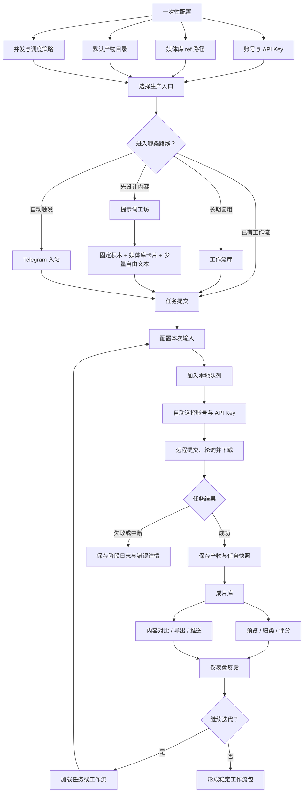

### 使用分支

| 分支 | 入口 | 适合场景 |
| --- | --- | --- |
| 快速提交 | 任务提交 → 导入 JSON | 临时测试、一次性生成 |
| 工作流复用 | 工作流库 → 加载 | 固定模板、长期生产 |
| 提示词优先 | 提示词工坊 → 导入任务 | 先设计 H3 内容，再选择工作流执行 |
| 资源库创作 | 提示词工坊 → 人物 / 动作 / 背景 / 音频 / 服装 | 使用真实媒体资产组合提示词 |
| 成片迭代 | 成片 → 加载任务 → 修改 → 再提交 | 对比多个版本、持续优化 |
| 批量队列 | 连续提交多个任务 | 利用本地队列和并发能力 |
| Telegram 图片入站 | Telegram 图片 → 固定或随机工作流 | 手机端触发批量生成 |
| Telegram 视频入站 | Telegram 链接 → 下载 → 工作流 | 处理抖音、Bilibili 或 X 视频 |
| 成片推送 | 任务完成 → Telegram | 自动发送生成结果 |
| 专注模式 | Focus 模式 | 将多个页面组合成连续工作台 |
| 数据分析 | 仪表盘 | 查看消耗、效率和高分工作流 |

专注模式是多个页面的组合交互方式，仪表盘是生产结果的统计反馈，设置则是运行前置条件；它们不是独立于主生产链路之外的另一套任务系统。

### 产品理念

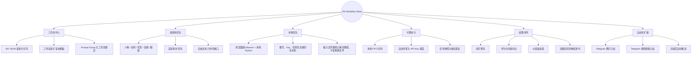

H3 场景下，推荐遵循下面的内容组装顺序：

```text
用户需求
→ 真实媒体卡片
→ 固定提示词积木
→ 少量自由文本
→ Prompt Group
→ API 工作流
→ 可复现任务
→ 成片反馈
```

也就是说，提示词工坊的目标不是单独产出一段文本，而是将真实的人物、动作、背景、音频和结构化提示词，组合成能够与工作流输入顺序保持一致的内容资产。自由文本只用于补充媒体库和固定积木尚未覆盖的时间变化、镜头衔接或用户专属要求。

## 按页面划分的数据流

下面的图以使用者看到的页面为主线，同时标出本地数据、远程执行和页面之间的恢复关系。产品的核心数据对象有五类：临时工作流快照、工作流库条目、媒体资源、任务记录和成片文件；提示词组是工作流快照和工作流包的内部组成部分。

### 页面总览

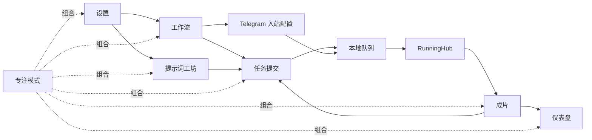

### 1. 设置页面：建立运行环境

设置页面主要产生配置数据，不直接生成任务。保存后的配置会被任务提交页、提示词工坊和本地调度器共同消费。

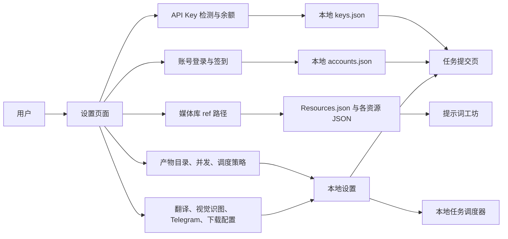

### 2. 工作流页面：把 API JSON 变成可复用模板

工作流页面负责管理工作流库和临时工作流快照。外部导入或从工作流库加载得到的临时快照不会自动成为工作流库记录。

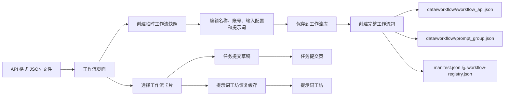

### 3. 提示词工坊：从资源到 Prompt Group

提示词工坊的输入优先来自真实资源库。当前组装台属于临时工作流快照；保存工作流时，提示词组会随工作流包一起保存，不需要单独管理。

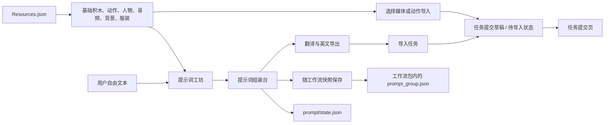

在 H3 场景中，推荐的数据顺序是：

```text
用户需求 → 真实媒体卡片 → 固定提示词积木 → 少量自由文本 → Prompt Group
```

### 4. 任务提交页面：从草稿到远程任务

任务提交页面是执行中心。输入文件通常只保存本机绝对路径，真正上传发生在任务被本地调度器执行时。

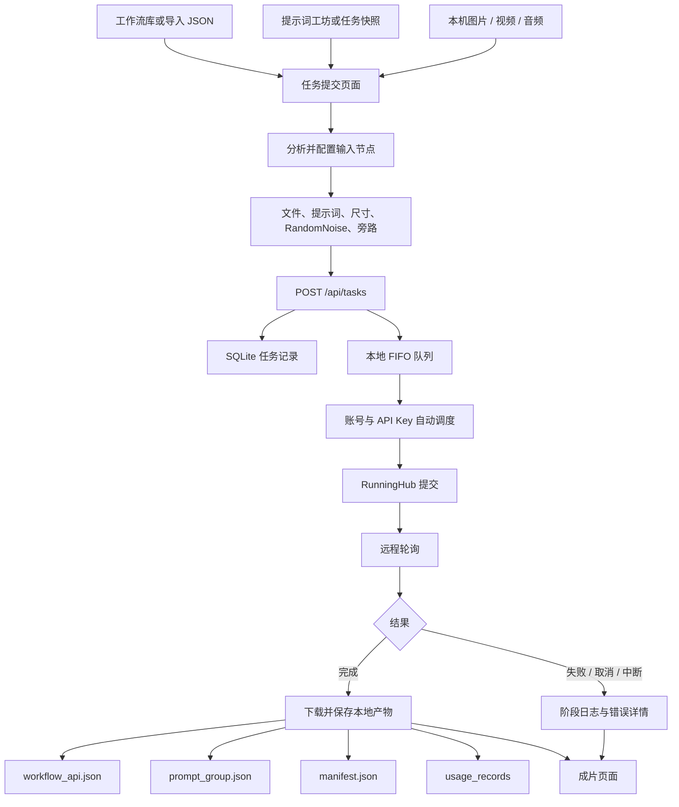

### 5. 成片页面：从文件回看，到再次生产

成片页面既是结果浏览器，也是迭代入口。评分、项目归类和对比不会修改原始工作流文件。

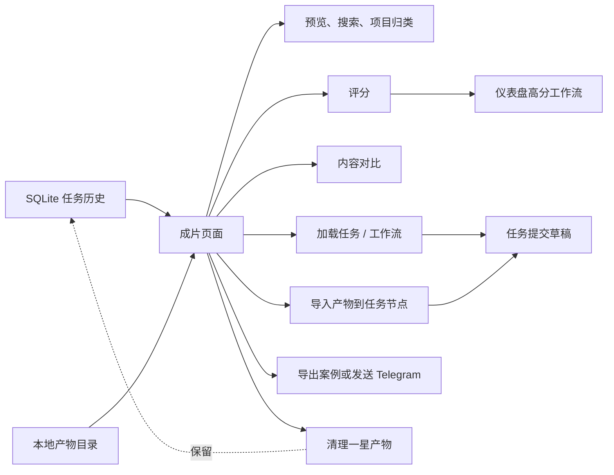

### 6. 仪表盘页面：消费数据而不是生产数据

仪表盘主要是只读分析层，不参与工作流提交。它把任务用量、账号余额、产物评分和视频处理效率汇总成决策信息。

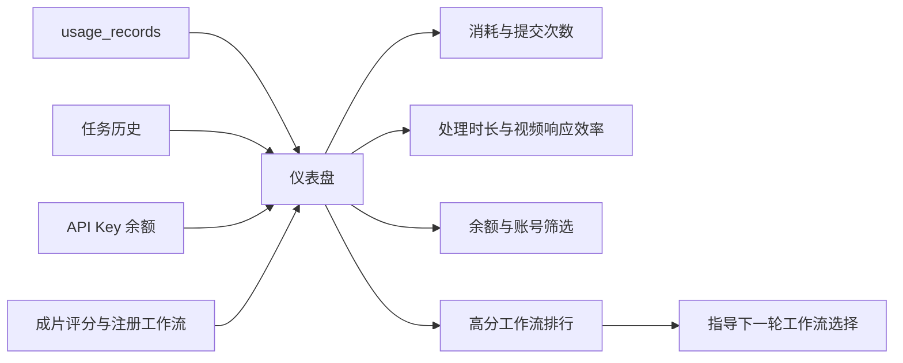

### 7. Telegram 自动化：绕过页面入口，但复用同一任务系统

Telegram 是自动化入口，不是另一套执行后端。图片入站和视频链接入站最终都会进入相同的本地队列、任务历史、成片库和仪表盘。

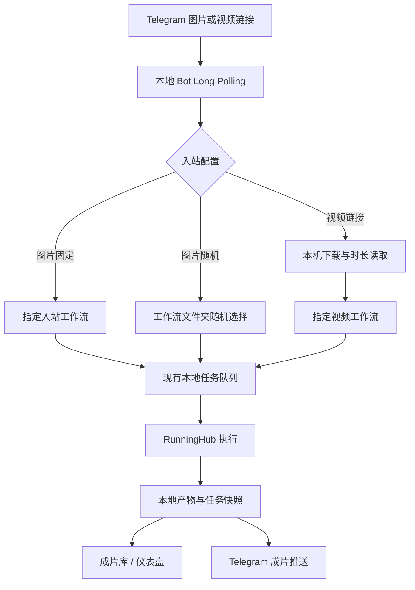

### 8. 专注模式：改变页面组织，不改变数据归属

专注模式把工作流、提示词工坊、任务提交、成片、仪表盘和设置组合到一个连续画布中。工具箱已经并入任务提交页的子导航，不会产生独立的“专注模式数据仓库”。

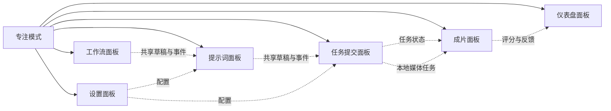

## 说明

- 工作流必须是 ComfyUI API 格式：顶层为节点字典，每个节点包含 `inputs` 和 `class_type`。
- 文件输入会识别常见的 `LoadImage`、`LoadAudio`、`LoadVideo`、`VHS_LoadVideo` 等节点。
- 提示词会识别 `CLIPTextEncode`、`TextEncode*`、`Prompt` 等节点中的文本字段。
- 文件输入支持拖入文件、在输入卡片中按 `⌘V` / `Ctrl+V` 粘贴图片，或点击“预览”进行图片/视频预览；视频节点会使用本机流式预览并支持播放、暂停和进度拖动。剪贴板图片会保存到 `data/pasted-inputs/` 并以本机绝对路径提交。浏览器不会把拖入文件的原始路径交给网页，因此普通文件要提交任务请点击路径框旁的“选择文件”，由 macOS 原生文件选择器返回真实绝对路径，也可以手动填写本机绝对路径。普通拖入文件不会复制到项目目录，真正的远程上传只在执行任务时发生。
- 每个文件、提示词和 RandomNoise 输入卡都支持“旁路”：开启后，本次提交会从 API 工作流中移除该节点，并删除直接指向其输出的下游连线；当前输入不会上传或覆盖。当前填写内容会保留在页面和任务记录中，关闭旁路后可以继续使用。
- 拖动文件悬停在整个输入卡片上方时，卡片会显示绿色发光反馈；工作流输入区域顶部会列出文件和提示词节点标签，点击标签可快速定位到对应卡片。
- 任务队列中的“加载”可以把该任务保存的 API 工作流、文件路径、提示词、workflowId、RandomNoise 配置和提交时的提示词组状态恢复到左侧面板；进入提示词工坊时会同步恢复该组装台内容，加载不会复制输入文件。
- 任务队列会先在本地按每个 API Key 的并发上限调度；个人 API Key 的第 4 个任务会保持在本地等待队列，当前任务释放槽位后自动提交。点击任务名称打开详情，“加载”用于恢复到左侧面板。
- 每次提交都会在任务产物目录的 `<task_id>/workflow_api.json` 保存本次 API 工作流快照，同时保存 `prompt_group.json` 和 `manifest.json`；manifest 记录本次提交的工作流、提示词组、执行参数以及输入文件原始路径，不复制输入文件。普通提交保存当前组装台或 API 请求显式提供的提示词组，Telegram 入站提交保存所选工作流包关联的提示词组。加载任务时优先读取任务自己的快照，旧任务在原始工作流和提示词组仍存在时会自动补写复现路径清单。
- 输入区域支持添加 `RandomNoise` 节点，默认写入 `noise_seed` 和 `mode` 两个参数，模式可选 `fixed` 或 `randomize`；导出或提交时会保留该节点。
- 任务提交栏按“提交机型 → 项目选择 → 提交次数”横向排列。“项目选择”会列出本地已有项目；选择具体项目会直接归类到该项目，选择“未归类”会停用路径推断；“自动归类”会依次检查产物输出目录和工作流路径，找到 `projects/<项目名>` 时使用该目录作为项目，否则保持未归类。
- 提交栏的“提交次数”默认是 1，只有存在未旁路且模式为“随机”的 `RandomNoise` 节点时才生效，最多可将同一任务连续加入队列 20 次；每次提交前在本机生成新的随机种子，将种子写入该次 `workflow_api.json` 快照和 `random_noise` 参数后再加入队列；固定模式始终只提交 1 次。
- 工作流页面支持 `Ctrl + Enter` 快捷提交；任务完成后，任务队列和详情会显示本次消耗的 RH 币或金额。
- 设置中的默认产物目录支持点击“选择文件夹”通过 macOS/Electron 原生选择器填入绝对路径，仍需点击“保存路径”确认。
- 导入的工作流如果已经保存了本机绝对图片路径，应用会直接读取该路径生成内存预览；任务详情中的“阶段日志”和“错误详情”会持久化到本地数据库，API Key、token、密码等敏感字段会脱敏。
- 顶部“工作流”页面只显示用户明确保存到工作流库的完整工作流包，并按账号分组；外部导入、从工作流库加载和历史任务产生的临时工作流快照不会自动进入工作流库。保存工作流时，当前快照中的提示词组会作为同一工作流包中的 `*.prompt_group.json` 文件一起保存；从工作流库加载时会复制一份快照，并同时准备任务提交页和提示词工坊的工作台。更新库内工作流应保存为新的库条目，迁移活动引用后再删除旧条目；删除工作流不会删除任务历史和产物。
- 导入工作流后需要填写 RunningHub 工作流页面对应的 `workflowId`，它不同于本地保存用的 `wf_...` ID；提交时会单独传给 RunningHub，任务历史也会保留该 ID。
- “导出当前 API”会把当前文件/提示词配置和已旁路后的节点图一起写入 JSON；非空的 `__rh_meta__.workflowId` 会一并保留。重新导入该文件时会自动回填；真正提交前会剥离这段本地元数据，不会发送给 RunningHub。
- 提示词页面的“积木库”可以切换“基础积木”、动作、人物、音频、背景和服装。媒体库统一以 `VideoMake/ref` 为根目录，读取 `pose/pose.json`、`character/character.json`、`audio/audio.json`、`background/background.json` 和 `clothes/clothes.json`；设置页只需配置一次 ref 文件夹。动作/参考卡片支持媒体预览、文本预览和标签编辑，保存后会回写对应 JSON。
- 提示词工坊的“自由文本”卡片可通过阿里云翻译为英文；原文修改后需要重新翻译。复制、导出 TXT 和导入任务始终只使用英文翻译结果，存在未翻译的非空自由文本时会阻止这三个操作。阿里云翻译可在任务提交页“设置”中配置，或使用 `ALIBABA_CLOUD_ACCESS_KEY_ID` / `ALIBABA_CLOUD_ACCESS_KEY_SECRET` 环境变量。
- 任务完成并保存本地产物后，可在任务提交页“设置”中启用 Telegram 成片推送；图片、视频、音频和其它文件分别使用对应的 Telegram Bot API 接口发送。推送失败不会影响任务状态，发送结果会写入任务阶段日志；Bot Token 只保存在本机 `web/data/keys.json`，也支持 `RH_TELEGRAM_BOT_TOKEN`、`RH_TELEGRAM_CHAT_ID` 和 `RH_TELEGRAM_ENABLED` 环境变量。
- 基础积木路径从 `VideoMake/ref/Resources.json` 的 `sources.prompt` 解析。JSON 顶层使用 `blocks` 数组，每项包含 `id`、`category`、`tags`、`title` 和 `text`；内容按 MiniMax H3 的模式对齐、参考定义、镜头动作、摄影机、声音、对白和音乐字段拆分，拖入工作台后按顺序拼接。修改、新建和删除都会直接回写该 JSON 文件。
- 动作库中的“导入媒体”会读取当前任务提交页草稿里的 `LoadImage` 节点；动作卡片导入对应深度图，人物/背景/服装等参考卡片导入原图。选择目标节点后，文件的本机路径会写回该节点并保存到本机草稿，之后打开任务提交页会自动恢复。没有任务草稿时，需要先在任务提交页导入工作流。
- 动作素材必须使用同一个 basename 配对：原图放在 `VideoMake/ref/pose/color/<name>.<ext>`，深度图统一直接放在 `VideoMake/ref/pose/depth/<name>_depth.png`，骨骼图统一直接放在 `VideoMake/ref/pose/skeleton/<name>_skeleton.png`，不再使用深度图分类子目录；`pose.json` 的同一个动作对象中维护 `color_image_path`、`depth_image_path` 和可选的 `skeleton_image_path`。动作库会检查原图/深度图配对，并额外暴露骨骼图是否可用。
- “任务提交”页通过子导航提供三个可扩展功能区：普通 RunningHub 工作流提交、Codex 图像生成、深度与骨骼处理。Codex 图像生成支持 0 到多张参考图，并可选择 1K/2K/4K 分辨率和画幅比例，默认 1K、9:16；命令细节完全由应用在后台处理，用户只需填写生成要求。每次运行自动生成 `task_<id>`，输出写入设置中的产物目录。深度、骨骼和深度+骨骼支持图片单张处理及视频逐帧处理，结果也进入任务历史和成片库；旧地址 `/toolbox` 会自动跳转到 Codex 功能区。
- 工作流输入、提示词工坊媒体、任务提交节点视频和成片库视频都支持右键菜单“截取当前帧”；截取位置取当前播放时间，保存后可继续作为图片输入使用。
- 动作编辑器支持用本机 DWPose 自动生成骨骼图；它输出接近你参考图的 OpenPose 风格黑底、彩色肢体线、面部/手部关键点图，保持原图尺寸。运行环境位于 `VideoMake/.runtime/pose_dwpose/`，模型文件为 `checkpoints/dw-ll_ucoco_384.onnx` 和 `checkpoints/yolox_l.onnx`，生成脚本为 `VideoMake/tools/pose_skeleton_macos.py`。
- 骨骼图生成面向常规真人姿态参考；动漫、严重遮挡、极近裁切或非人体主体可能识别不完整，识别失败时不会写入空图。
- 扩展动作时直接新增素材和 `pose.json` 中的动作对象：新增原图、生成同名 `_depth.png` 和 `_skeleton.png`，在 JSON 中填写分类、名称、提示词及三条相对路径；重新进入动作库或点击“重新扫描”即可更新。应用直接读取 JSON，不再生成或依赖 `data/prompt/actions.json` 缓存。
- 设置中的“个人 API Key 并发数”可配置为 1–3，默认 3，只影响普通个人 API Key；`apiType` 包含 `wallet`、`shared` 或 `enterprise` 时，本地调度器固定按 100 个并发槽处理。
- 设置中的“API Key 调度策略”支持“仅使用个人”“优先个人，满载时使用共享/企业”和“仅使用共享/企业”三种模式；任务提交页不再选择 API Key，所有提交统一按该策略自动调度。优先模式下个人 Key 有空闲槽位就优先使用，个人槽位满后才把新任务放入共享/企业 Key；个人槽位释放后，后续等待任务会及时切回个人。
- 设置中的“账号管理”支持分别添加 `runninghub.cn` 和 `runninghub.ai` 账号。首次添加会打开对应站点的 Electron 登录窗口；每个账号使用独立的持久化本地浏览器会话，关闭并重新启动 Electron 后仍可继续使用。点击“签到”会刷新会话并读取 RunningHub 网站返回的 `loginCoinTriggered` / `loginDailyCoin` 状态；如果网站要求重新认证，需要在账号窗口重新登录。网站未返回奖励时，界面会如实显示“未返回奖励”，不会把 100 RH 币当成已签到。
- 应用重启后，任务会先检查 `<输出目录>/<task_id>/`：如果已经存在产物，就重建本地产物记录并恢复为“已完成”；如果没有产物但保留了远程 `taskId`，则自动恢复轮询并继续下载；只有没有远程 `taskId` 的任务才会保留为“已中断”。
- 成片库中每个产物卡片的工作流名称可以直接点击；应用会读取该任务保存的 API 快照和输入配置，写入本地任务提交草稿，但不会自动跳转页面。
- 成片库右上角的“删除一星成片”和“导出所有案例”只作用于当前打开的项目文件夹，按钮数量也按该文件夹计算；“未归类”只处理未归类成片，返回“全部成片”后才使用全库范围。删除只移除标记为 1 星的产物文件和产物记录，保留任务记录及其他星级产物，执行前会二次确认；导出只打包带“案例”标签的媒体文件。
